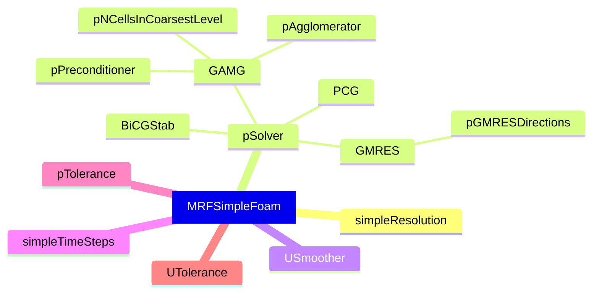
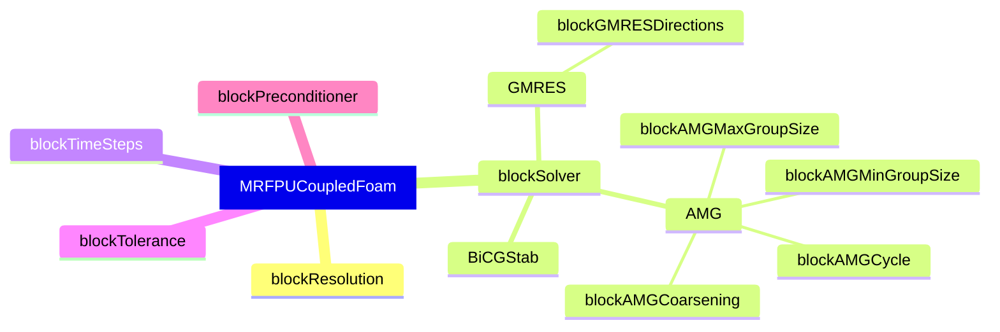

# Investigation of FoamExtend 5.0 coupled solvers implementations

<!-- mtoc-start:cb9ef56 -->

* [Scope and Goals](#scope-and-goals)
* [Side-effect investigation](#side-effect-investigation)
* [Getting started](#getting-started)
* [Quick optimization notes](#quick-optimization-notes)
  * [Search space setup](#search-space-setup)
  * [Current configuration to beat](#current-configuration-to-beat)

<!-- mtoc-end:cb9ef56 -->

## Scope and Goals

- Make sure coupled and segregated versions of solvers converge to the **same solution**
- Forming an opinion on performance preferences for coupled solver settings through case optimization
- This mainly concerns steady-state rotating flows with MRF 
  - In laminar conditions

The aim is to:

- Find case configurations, if any, where:
  - coupled solvers deliver roughly the same solution as segregated ones
  - coupled solvers deliver the solution more efficiently in serial setup

## Side-effect investigation

- [x] `potentialFoam` initialization before solver runs
   - Seems to generally speed up the execution time by 20%-25%
- [ ] Problems with AMI/GGI interface in/without MRF setting

## Getting started

- Run the `prepare.sh` script first to make sure you have the prerequisites

---

If you don't care about the optimization, and just want to compare solvers:

- `cases/taylor-couette-3d` is an MRF case which has an analytical solution
- `cases/absolute-taylor-couette-3d` is the same case in absolute setting

1. Make sure `cases/taylor-couette-3d` case has `fvSolution` and `controlDict` versions for your solvers
   - Eg. `cases/taylor-couette-3d/system/MRFSimpleFoam.fvSolution` for `MRFSimpleFoam`
   - Same goes for the absolute case `cases/absolute-taylor-couette-3d`
1. Run `./Allclean && ./Allrun <solver-name>` for each solver you want to compare against
1. Run `uv run --script scripts/taylor_couette_analytical.py --plot --compare <solver1> <solver2> ...`
4. Run `uv run --script scripts/compare_solvers.py --plot --compare <solver1> <solver2> ...`
   - This is setup for comparisons between two solvers
   - Residual logs must match either `simpleFoam` style or `pUCoupledFoam` style

---

If you want to meddle with the optimization side:
1. Use `foamBO` CLI as instructed by `prepare.sh` to either
   - run a new optimization
   - check on the pushed surrogate model

## Quick optimization notes
 
### Search space setup

The parameter space is set up in a hierarchical structure as the considered parameters
depend heavily on each other. Due to backend framework limitations, the dependency tree
must have single root parameter; which is chosen to be the `solver`, with values
`MRFSimpleFoam` and `MRFPUCoupledFoam`.

Considered dependent parameters for `MRFSimpleFoam` are:


Considered dependent parameters for `MRFPUCoupledFoam` are:


A sample optimization state is provided at `artifacts/CoupledVsSegregated_client_state.json`
which you can explore with:
```bash
uvx foamBO --visualize --config MOO.yaml ++store.read_from=json
```

### Current configuration to beat

Better pressure prediction:
```json
{
  "solver": "MRFSimpleFoam",
  "pSolver": "GMRES",
  "pTolerance": 1e-5,
  "simpleResolution": 1,
  "simpleTimeSteps": 1213,
  "USmoother": "GaussSeidel",
  "UTolerance": "3e-8"
}
```

Better velocity field prediction:
```json
{
  "solver": "MRFSimpleFoam",
  "pSolver": "PCG",
  "pTolerance": 1e-5,
  "simpleResolution": 1,
  "simpleTimeSteps": 1339,
  "USmoother": "GaussSeidel",
  "UTolerance": "7e-8"
}
```
